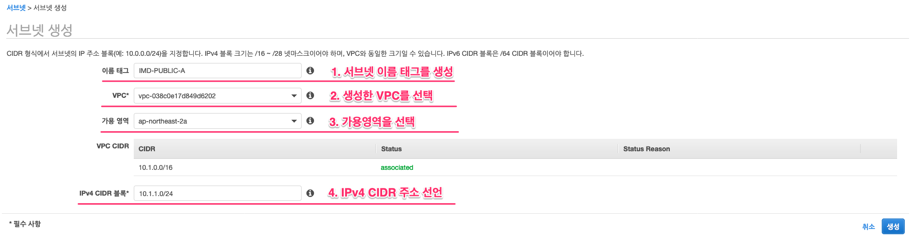

# EC2-Windows

## 소개

Amazon Elastic Compute Cloud\(EC2\)는 안전하게 자원의 크기 조정이 가능한 컴퓨팅 파워를 클라우드상에서 제공하는 웹 서비스입니다. 개발자가 더 쉽게 클라우드 컴퓨팅 작업을 할 수 있도록 설계되었습니다. Amazon EC2의 간편한 AWS Management Console을 통해 간편하게 필요하게 용량을 얻고 구성할 수 있습니다. 컴퓨팅 리소스에 대한 포괄적인 제어권을 제공하며, Amazon의 검증된 컴퓨팅 환경에서 실행할 수 있습니다.

Amazon EC2는 AWS Management Console을 사용해 다양한 운영 체제로 인스턴스를 시작하고, 이를 사용자 정의기반 애플리케이션 환경으로 로드하며, 네트워크의 액세스 권한을 관리하고, 원하는 수의 시스템을 사용해 이미지를 실행할 수 있는 진정한 가상 컴퓨팅 환경을 제공합니다.

이 랩에서는 AWS Management Console을 사용하여 Amazon EC2에서 윈도우 서버 기반 웹 서버를 시작, 구성 및 사용자 요구에 맞게 구성하는 과정을 안내합니다.

## 목적

본 랩은 아래와 같은 구성을 통해 EC2 기반의 운영체제와 어플리케이션을 구성하는 데 도움을 드립니다.

![\[&#xC2DC;&#xC2A4;&#xD15C; &#xBAA9;&#xD45C; &#xAD6C;&#xC131;&#xB3C4;\]](../.gitbook/assets/image%20%28176%29.png)

* **간단한 VPC 자원의 생성과 구성**
* **EC2 생성을 위한 키페어 생성**
* **EC2 생성을 위한 속성과 상세 사항 설정**
* **EC2를 위한 스토리지 구성과 보안 그룹 설정**
* **EC2 접속 방법**
* **EC2 인스턴스 타입 , 볼륨 크기 변경**
* **EC2 기반 스냅샷 생성과 볼륨 생성**

## **Task1. VPC 생성하기**

### **1.AWS 서비스-VPC 탐색**

* **"AWS Management Console - AWS 서비스"** 에서 **"서비스 찾기"** 창에 VPC를 탐색하고, VPC를 선택합니다.


### **2. VPC 선택**

* **VPC를 선택**합니다.


### **3. "VPC 생성" 및 값 입력**


* **이름 태그** : VPC 이름 태그를 입력합니다.
* **IPv4 CIDR 블록** : VPC에서 사용할 IPv4 주소 대역을 입력합니다.


생성된 VPC 정보를 확인합니다.

### **4. DNS 호스트 이름을 활성화**

* 생성되는 EC2 인스턴스의 DNS Name 서비스 활성화를 위해, **"작업"**을 선택하고 **"DNS 호스트 이름 편집"**을 선택합니다. **DNS 호스트 이름을 활성화**합니다. ****


### **5.Public ,Private 서브넷 생성.**

* 좌측 VPC 대시보드에서 **"가상 프라이빗 클라우드" - "서브넷"** 메뉴를 선택하고, **"서브넷 생성"**을 선택합니다.
* 4개의 서브넷을 각각 생성하고, 속성을 정의합니다.

| **서브넷 이름 태그** | 가용영역 | **IPv4 CIDR 블록** |
| :--- | :--- | :--- |
| IMD-PUBLIC-A | ap-northeast-2a | 10.1.1.0/24 |
| IMD-PUBLIC-B | ap-northeast-2c | 10.1.2.0/24 |
| IMD-PRIVATE-A | ap-northeast-2a | 10.1.11.0/24 |
| IMD-PRIVATE-B | ap-northeast-2c | 10.1.12.0/24 |



* 4개의 서브넷이 정상적으로 구성되어 있는지 확인합니다.


### **6. 라우팅 테이블을 생성.**

| 라우팅 테이블 이름 태그 | 서브넷 연결 |
| :--- | :--- |
| PUBLIC-RT | IMD-PUBLIC-A , IMD-PUBLIC-B |
| PRIVATE-RT | IMD-PRIVATE-A, IMD-PRIVATE-B |

* 좌측 VPC 대시보드에서 **"가상 프라이빗 클라우드" - "라우팅 테이블"** 메뉴를 선택하고, **"라우팅 테이블 생성"**을 선택합니다.
* 2개의 라우팅 테이블을 각각 생성하고, 속성을 정의합니다.


* 각 라우팅 테이블에 서브넷을 연결합니다.  PUBLIC-RT, PRIVATE-RT 모두 구성합니다.


### **7. 인터넷 게이트웨이를 생성.**

* 좌측 VPC 대시보드에서 **"가상 프라이빗 클라우드" - "인터넷 게이트웨이"** 메뉴를 선택하고, **"인터넷 게이트웨이 생성"**을 선택합니다.
* 인터넷 게이트웨이 이름을 정의합니다.


* 인터넷 게이트웨이를 VPC에 연결합니다.


* 인터넷 게이트웨이의 상태가 "Attached"로 변경되었는지 확인합니다.


### 8. 라우팅 테이블 업데이트

* Public-RT 라우팅 테이블에 인터넷 게이트웨이로 향하는 트래픽을 업데이트하기 위해, "**라우팅 테이블" - "PUBLIC-RT"**를 선택하고 **"라우팅 편집"**을  선택합니다.


* **"라우팅 추가"**를 선택하고, "**대상"**에 "**0.0.0.0/0"**, **"생성한 IGW"**를 입력하고 선택합니다.


## **Task2. EC2 생성하기**

### **9. EC2 키페어 생성**


**키 페어는 1회 다운로드 이후, 다시 다운로드 받을 수 없습니다. 키 페어를 통해 EC2 인스턴스에 접속하기 때문에 키페어 다운로드 위치를 반드시 파악해 두고 잘 관리해야 합니다.**


* EC2 대시보드에서 **"네트워크 및 보안" - " 키 페어"**를 선택합니다.
* **"키페어 생성"**을 선택합니다.


* 윈도우 Administrator 접속 시 사용되는 키페어를 생성합니다.


* 키페어를 로컬로 다운로드 받습니다.

### **10. EC2 대시보드에서 인스턴스 시작을 선택.**


### **11. AMI를 선택.**

* **Microsoft Windows Server 2012R2 Base AMI\(Amazon Machine Image\)** 를 선택합니다. 


### **12. 인스턴스 유형을 선택.**

* **인스턴스 유형 - t2.medium** 을 선택합니다.


### **13. 인스턴스 세부 정보를 구성.**

| 인스턴스 세부 정보 | 값 |
| :--- | :--- |
| 인스턴스 개수 | 1 |
| 네트워크 | IMD-VPC |
| 서브넷 | IMD-PUBLIC-A \| ap-northeast-2a |
| 퍼블릭 IP 자동할당 | 활성화 |


* 사용자 데이터 예.

```text
<powershell>
Import-Module ServerManager;
Install-WindowsFeature Web-Server -IncludeManagementTools -IncludeAllSubFeature
remove-item -recurse c:\inetpub\wwwroot\*
(New-Object System.Net.WebClient).DownloadFile("https://immersionday-labs.s3.amazonaws.com/ec2-windows.zip", "c:\inetpub\wwwroot\ec2-windows.zip")

$shell = new-object -com shell.application
$zip = $shell.NameSpace("c:\inetpub\wwwroot\ec2-windows.zip")
foreach($item in $zip.items())
{
$shell.Namespace("c:\inetpub\wwwroot\").copyhere($item)
}
</powershell>
```

* 위의 "사용자 데이터 예"를 복사해서 값을 입력합니다.


* "다음:스토리지 추가"를 선택합니다.

### 14. 스토리지 추가.


* AWS에서 제공하는 볼륨 유형들을 확인합니다.
* **범용 SSD\(gp2\) 타입**을 선택합니다.
* **"다음-태그 추가"**를 선택합니다.

### **15. 태그 추가를 구성.**

* 키와 값의 내용을 입력합니다.
* **키 : IMD-EC2 , 값: PUBLIC-03**


* "다음:보안그룹구성"을 선택합니다.

### **16.보안그룹구성 구성.**

* 아래와 같은 값으로 보안 그룹\(Security Group\)을 구성합니다.

| 유형 | 프로토콜 | 포트범위 | 소스 |
| :--- | :--- | :--- | :--- |
| RDP | TCP | 22 | 위치무관 |
| HTTP | TCP | 80 | 위치무관 |
| 모든 ICMP-IPv4 | ICMP | 0-65535 | 위치무관 |

* 보안 그룹 할당 - 새 보안 그룹 생성
* 보안 그룹 이름 : IMD-W2K-PUB-SG
* 설명 : Security Group for IMD-W2K-PUB
* "검토 및 시작"을 선택합니다.


### 17. 인스턴스 시작 검토를 확인.

* 검토를 완료하고 **"시작하기"**를 선택합니다.


### **18. 키 페어 선택 .**

* **"기존 키 페어 선택"을 선택하고 , 해당 키페어를 선택합니다.**\(예. W2K-Key\)
* **"인스턴스 시작"**을 선택해서 인스턴스를 생성합니다.



**위의 과정을 반복하여, 서브넷 "IMD-PUBLIC-B" - 가용영역 "ap-northeast-2c"에 EC2 인스턴스를 한 개 더 만들어 봅니다.**


## Task3. EC2 접속하기

### 19. EC2 접속 환경 구성

* **정상적으로 EC2 인스턴스들이 구성되었는 지 확인해 봅니다. 인스턴스를 선택하면 Meta 정보들을 확인 할 수 있습니다.**


* 웹기반 클라이언트로 접속이 가능합니다. 접속하려는 **EC2 인스턴스를 선택**하고, EC2 대시보드 상단의 메뉴에서 **"연결"**을 선택합니다. 


* **"독립 실행형 RDP 클라이언트"** 를 선택하고, **암호 - 암호가져오기** 를 선택합니다.


* **로컬에 저장해 둔 키페어를 "키 페어 경로"** 에 선택하고, "**암호해독"** 을 선택합니다.


* RDP 접속 프로그램을 통해 해독된 Administrator 암호를 입력하여 접속합니다.


* 정상적으로 접속되는 지 확인합니다.


### **20. EC2 Windows Server Web 접속**

* 로컬 브라우저\(파이어폭스, 크롬\)에서 아래 URL로 접속합니다.아래 예제와 같이 EC2 정보들을 확인해 봅니다.

```text
"ec2-public-ip or public DNS"
```


### 21. EC2 Instance Type 변경

* EC2 인스턴스의 자원이 추가적으로 요구 될 경우, 인스턴스 유형을 변경할 수 있습니다.
* 실행 중인 인스턴스를 선택하고 EC2 대시보드 상단 메뉴 **"작업" - "인스턴스 상태" - "중지"**를 선택합니다.


* **"Stopped"**된 인스턴스를 선택하고 EC2 대시보드 상단 메뉴 "작업" - "인스턴스 설정" - "인스턴스 유형 변경"을 선택합니다. **t2.large 인스턴스 유형**으로 변경하고 **"적용"**을 선택합니다.


### 22. EC2 Volume 크기 변경

* EC2 인스턴스의 볼륨 크기가 추가적으로 요구 될 경우, 볼륨 유형을 변경하거나 크기를 늘릴 수 있습니다.
* 실행 중인 인스턴스를 선택하고 EC2 대시보드 좌측 메뉴에서 **"ELASTIC BLOCK STORE" - "볼륨"**을 선택합니다.
* EC2 대시보드 상단 메뉴에서 "작업" - "볼륨 수정"을 선택합니다.


* **볼륨 크기를 40GB**로 증가 시킵니다. 해당 메뉴에서 볼륨 유형을 변경할 수도 있습니다. 볼륨 크기를 변경하고, "**수정"** 을 선택한 후 **"예"**를 선택하고 수정합니다.


* 잠시 후 EC2 대시보드에서 확인하면 아래와 같이 볼륨이 증가 한 것을 확인 할 수 있습니다.


볼륨 변경은 시간이 20분 이상 필요합니다. EC2 인스턴스의 볼륨 상태가 "In-Use"로 활성화 될 때까지 기다린 후에 , EC2 인스턴스를 다시 시작합니다.



* \(Option\)Stop 했던 EC2 인스턴스를 다시 시작합니다. 인스턴스 타입과 볼륨이 정상적으로 OS에서 확인이 되는지 점검합니다. 원격 접속 터미널을 통해 Window Server EC2 인스턴스에 접속합니다.
* **바탕화면 우측 상단**에서 인스턴스 타입이 변경된 것을 확인합니다. **Window Task Manager**를 실행하고 메모리 용량이 **8GB**로 증가한 것을 확인합니다.


* **Window Server 실행** 대화 상자에 **diskmgmt.msc**를 입력하고 Enter 키를 누릅니다. 디스크 관리 유틸리티가 열립니다.


* **디스크 관리\(Disk Management\)** 메뉴에서 **작업**, **디스크 다시 스캔\(Rescan Disks\)**을 선택합니다.
* 확장된 드라이브를 오른쪽 클릭하여 컨텍스트 메뉴를 열고 **볼륨 확장\(Extend Volume\)**을 선택합니다.


* **Extend Volume\(볼륨 확장\)** 마법사에서 **다음**을 선택합니다. **MB 단위로 공간 크기 선택\(Select the amount of space in MB\)**에 볼륨 확장에 적용할 메가바이트 수를 입력합니다. 일반적으로 최대 사용 가능한 공간을 설정합니다. **선택\(Selected\)** 아래에 강조된 텍스트는 추가되는 공간의 양이며, 볼륨의 최종 크기가 아닙니다. 마법사를 완료합니다.


* 40GB 로 볼륨이 확장된 것을 확인합니다.


### 23. 스냅샷 생성 및 복구

* EBS 볼륨의 특정 시점 스냅샷을 생성하여 새 볼륨이나 데이터 백업의 기준으로 사용할 수 있습니다. 볼륨의 스냅샷이 주기적으로 생성되는 경우 스냅샷은 증분식이어서 새 스냅샷은 마지막 스냅샷 이후 변경된 블록만 저장합니다.스냅샷은 비동기적으로 생성됩니다. 특정 시점 스냅샷은 즉시 생성되지만 스냅샷이 완료될 때까지, 즉 수정된 블록이 `pending`로 모두 이동할 때까지 스냅샷 상태는 Amazon S3입니다. 따라서 크기가 큰 최초의 스냅샷이나 변경된 블록이 많은 후속 스냅샷의 경우 몇 시간씩 시간이 걸릴 수 있습니다. 완료하는 동안 진행 중인 스냅샷은 볼륨에 대한 지속적인 읽기 및 쓰기의 영향을 받지 않습니다.
* 랩에서는 기존 EC2에서 생성된 스냅샷을 새로운 볼륨으로 만들고, 기존 EC2 인스턴스에 연결하여 볼륨을 복구하는 과정을 구성해 봅니다.


* 스냅샷을 생성할 인스턴스를 선택하고, 인스턴스 ID를 복사합니다.


* EC2 대시보드 좌측 메뉴에서 "ELASTIC BLOCK STORE" - "스냅샷"을 선택하고 , "스냅샷 생성"을 선택합니다.


* 정상적으로 스냅샷이 구성되었는지 확인합니다.


* 생성된 스냅샷을 새로운 볼륨으로 생성합니다.


* 새로운 볼륨이 정상적으로 생성되었는지 확인합니다.


* 스냅샷으로 생성된 볼륨을 테스트 하기 위해 " PUBLIC-04" EC2 인스턴스에 RDP로 접속하고  , 바탕화면의 "EC2 Guide" 를 삭제하고, 휴지통을 비웁니다.


* 이제 "PUBLIC-04" 인스턴스에서 기존 볼륨을 제거하고, 스냅샷을 통해서 생성한 새로운 볼륨을 "PUBLIC-04" 인스턴스에 연결합니다. 먼저 "PUBLIC-04" 인스턴스를 중지합니다. 인스턴스를 중지하기 전에 해당 인스턴스 볼륨의 디바이스 이름을 확인해 둡니다.


* EC2 대쉬보드에서 "ELASTIC BLOCK STORE" - "볼륨"을 선택합니다. "PUBLIC-04" 볼륨을 선택하고 상단 메뉴 "작업"-"볼륨분리"를 선택합니다. 정상적으로 볼륨이 분리되었는지 확인합니다.


* EC2 대쉬보드에서 **"ELASTIC BLOCK STORE" - "볼륨"**을 선택하고 새로 만든 볼륨을 선택합니다. 상단 메뉴 **"작업"-"볼륨연결"**를 선택합니다. Stop되어 있는 **"PUBLIC-04" 인스턴스 ID**를 선택합니다. 디바이스는 **기존에 루트 디바이스 이름**을 입력합니다. **\(dev/sda1\)**


* 정상적으로 볼륨이 연결되었는지 확인합니다.


* Stop 시켜둔 "PUBLIC-04" EC2 인스턴스를 다시 "시작"하고 RDP로 접속합니다. 스냅샷 이후 삭제된 바탕화면의 "EC2 Guide" 바로가기가 보이는지 확인합니다.


인스턴스를 중지하고 다시 시작할 경우 IP 주소가 변경됩니다. 확인하고 RDP에 접속합니다.




EC2 Windows LAB을 성공적으로 마치셨습니다. 추가 상세한 내용들은 아래 참고 자료에서 확인 하실 수 있습니다.


## 참조 자료

* [Lunch Your Instance](https://docs.aws.amazon.com/AWSEC2/latest/UserGuide/LaunchingAndUsingInstances.html)
* [Amazon EC2 Instance Type](https://aws.amazon.com/ec2/instance-types)
* [Amazon Machine Images \(AMI\)](https://docs.aws.amazon.com/AWSEC2/latest/UserGuide/AMIs.html)
* [Amazon EC2- User Data and Shell Scripts](https://docs.aws.amazon.com/AWSEC2/latest/UserGuide/user-data.html)
* [Amazone EC2 Root Device Volume](https://docs.aws.amazon.com/AWSEC2/latest/UserGuide/RootDeviceStorage.html)
* [Tagging Your Amazone EC2 Resources](https://docs.aws.amazon.com/AWSEC2/latest/UserGuide/Using_Tags.html)
* [Security Groups](https://docs.aws.amazon.com/AWSEC2/latest/UserGuide/using-network-security.html)
* [Amazone EC2 Key Pairs](https://docs.aws.amazon.com/AWSEC2/latest/UserGuide/ec2-key-pairs.html)
* [Status Checks for Your Instances](https://docs.aws.amazon.com/AWSEC2/latest/UserGuide/monitoring-system-instance-status-check.html?icmpid=docs_ec2_console)
* [Amazon EC2 Metrics and Dimensions](https://docs.aws.amazon.com/AmazonCloudWatch/latest/monitoring/ec2-metricscollected.html)
* [Resizing Your Instanse](https://docs.aws.amazon.com/AWSEC2/latest/UserGuide/ec2-instance-resize.html)
* [Stop and Start Your Instance](https://docs.aws.amazon.com/AWSEC2/latest/UserGuide/Stop_Start.html)
* [Amazon EC2 Service Limits](https://docs.aws.amazon.com/AWSEC2/latest/UserGuide/ec2-resource-limits.html)
* [Terminate Your Instance](https://docs.aws.amazon.com/AWSEC2/latest/UserGuide/terminating-instances.html)
* [Terminate Protection for an Instance](https://docs.aws.amazon.com/AWSEC2/latest/UserGuide/terminating-instances.html)

